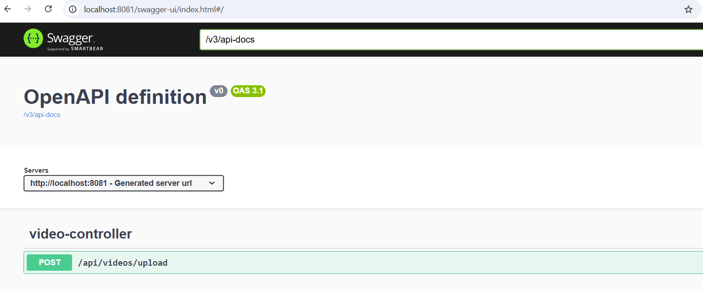

# 🎬 Video Metadata Extraction Tool

An end-to-end application that extracts metadata from video files, exposes it via REST APIs, and saves the metadata into a JSON file. This tool is especially useful in film production, media analytics, digital archiving, and video content management systems.

---

## 🚀 Features

- 🎥 Upload and analyze video files
- 📊 Extract detailed metadata:
    - Duration, resolution, frame rate, aspect ratio
    - Video/audio codec, bitrate, sample rate
    - Camera make/model, creation time, file size
- 🧾 Save metadata in structured JSON format
- 🌐 Expose REST API for external consumption
- ⚙️ Modular backend built with Spring Boot
- 🔍 Extensible architecture for additional media formats

---

## 🛠️ Tech Stack

- **Backend**: Spring Boot
- **Metadata Extraction**: FFmpeg
- **Build Tool**: Maven
- **Output Format**: JSON

---

## 📂 Project Structure

```
metadata-extractor/
├── src/
│ ├── main/
│ │ ├── java/
│ │ │ └── com/example/metadata/
│ │ │ ├── controller/
│ │ │ ├── exception/
│ │ │ ├── model/
│ │ │ └── service/
│ │ └── resources/
│ │ ├── application.yml
│ │ └── metadata/
│ │ └── <video-name>-metadata.json
├── pom.xml
└── README.md
```

---

## 📦 REST API Endpoints

| Method | Endpoint                          | Description                               |
|--------|-----------------------------------|-------------------------------------------|
| POST   | `/api/videos/upload`              | Upload a video file and returns meta data |

---

## 🧪 Sample Output

```json
{
  "fileName" : "upload_367823917094826738_A001_01011110_C013.braw",
  "durationSeconds" : 9,
  "format" : "mov,mp4,m4a,3gp,3g2,mj2",
  "width" : 6064,
  "height" : 4048,
  "frameRate" : 24.0,
  "videoCodec" : "",
  "videoProfile" : "",
  "videoBitRate" : 753810870,
  "audioCodec" : "pcm_s24le",
  "audioChannels" : 2,
  "audioBitRate" : 2304000,
  "audioSampleRate" : 48000,
  "fileSizeBytes" : 883519115,
  "creationTime" : "2024-08-27T04:50:28.000000Z",
  "filePath" : "upload_367823917094826738_A001_01011110_C013.braw",
  "hasAudio" : true,
  "hasVideo" : true,
  "aspectRatio" : "1.50:1",
  "resolutionCategory" : "4K",
  "cameraMake" : "",
  "cameraModel" : ""
}
```

---

## 📥 Getting Started

### 1. Clone the Repository

```bash
git clone https://github.com/your-username/video-metadata-extractor.git
cd metadata-extractor
```

### 2. Build the Project

```bash
mvn clean install
```

### 3. Run the Application

```bash
mvn spring-boot:run
```

---

## 🎯 Usage Example

### Upload a Video

```bash
curl -X POST -F "file=@/path/to/video.mp4" http://localhost:8080/api/videos/upload
```

---

## 🧩 Future Enhancements

💾 Save metadata to databases like MongoDB or PostgreSQL

🔒 Add authentication and authorization

📊 Web frontend for video uploads and metadata browsing

🧠 AI-based metadata enrichment

📁 Export metadata to CSV/Excel

🔁 Batch processing support

---

## 📜 Swagger UI
Once the application is running, visit:
http://localhost:8080/swagger-ui/index.html




## 🧪 Testing
Use Postman or any REST client to upload video files and verify metadata output. Ensure FFmpeg is installed and accessible in your system's PATH.

---
## 🤝 Contributing

Contributions, issues, and feature requests are welcome!

1. Fork the repository
2. Create your feature branch (`git checkout -b feature/new-feature`)
3. Commit your changes (`git commit -m 'Add new feature'`)
4. Push to the branch (`git push origin feature/new-feature`)
5. Open a pull request

---

## 📧 Contact

For inquiries or support, please contact.

---

> Built with ❤️ for developers working with video technology.
